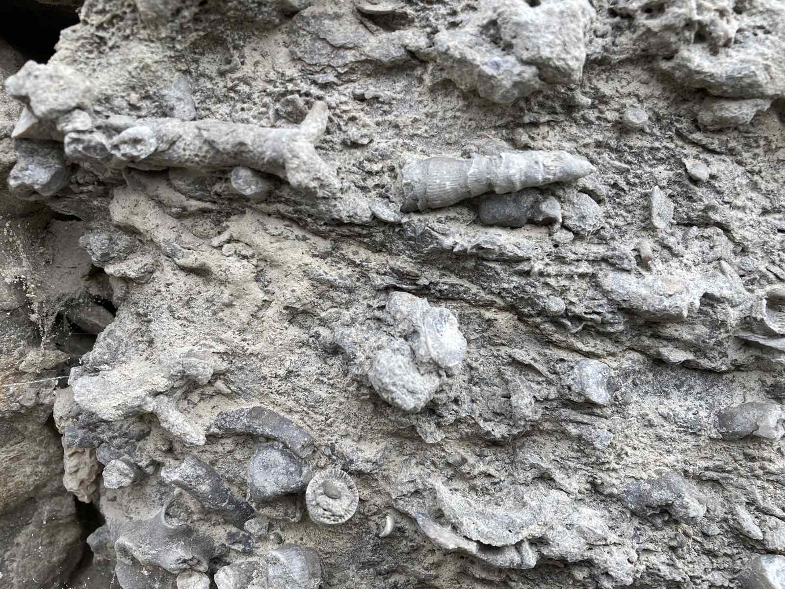
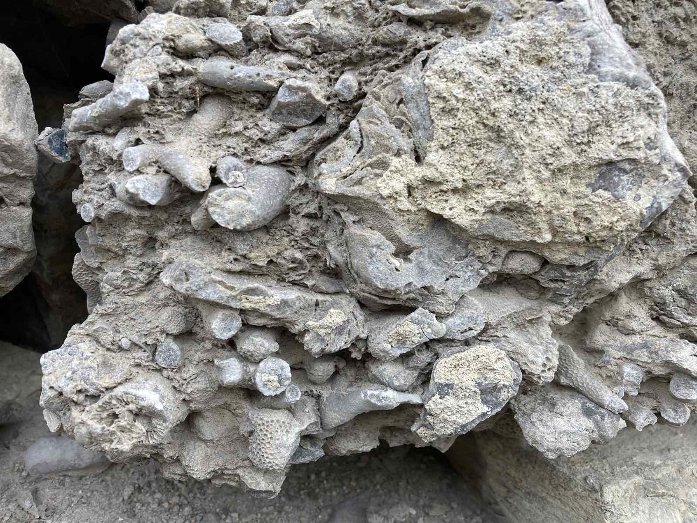
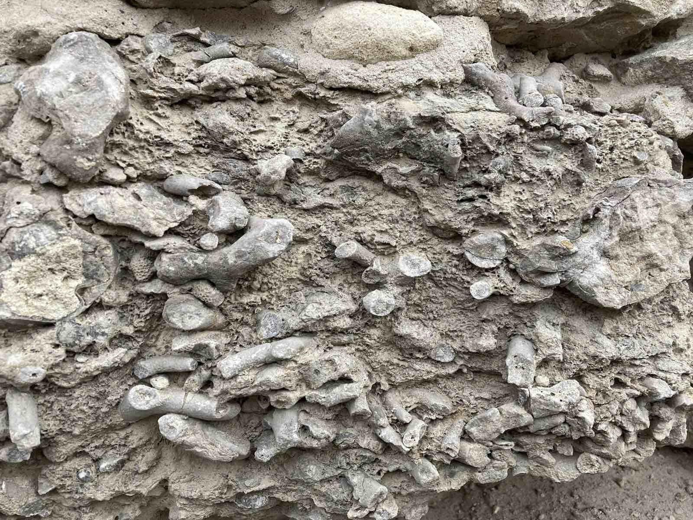
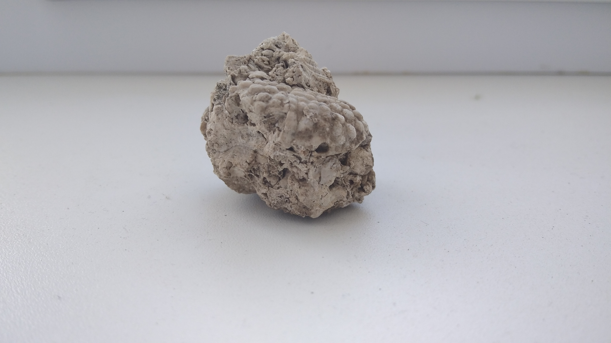
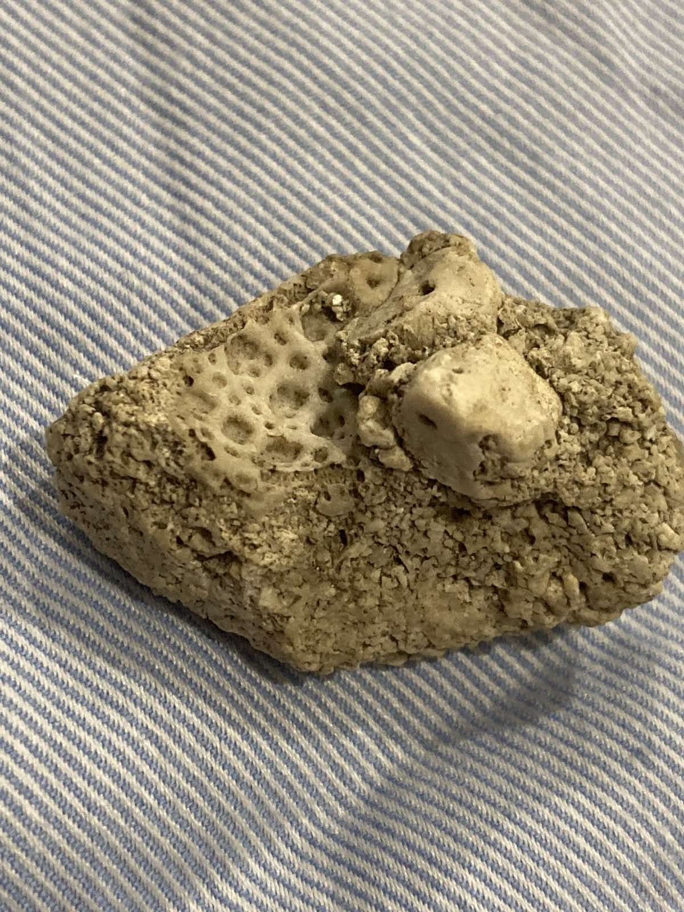

## Силур
- Тривав 24 млн років (443 - 419 млн р. тому)
- Живі істоти тільки почали виходити на суходіл
- У морях панували величезні головоногі та ракоскорпіони
- У каньйоні ріки Смотрич (м.Кам'янець-Подільський) можна знайти немало скам'янілостей цього періоду
- Нижче приведені знахідки з каньйону:
#### Різноманітні корали

#### Трилобіт

- Біля Сатанова також є виходи силурійських порід
- Нижче приведені скам'янілості звідти:
#### Корали, моховатки та морські лілії
 

 
## Неоген
- Тривав 20 млн років (23 - 2 млн р.тому)
- Панують ссавці, багато тварин нагадують сучасних
- На місці Поділля, була мілка лагуна, де жили краби, черевоногі та ін.
- Нижче приведені знахідки з цього періоду:
#### Краби

