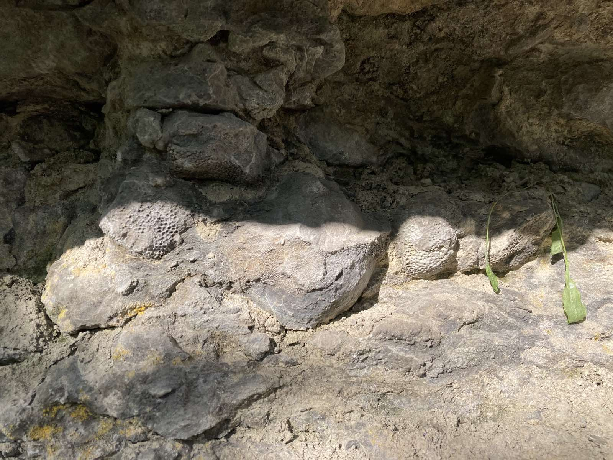
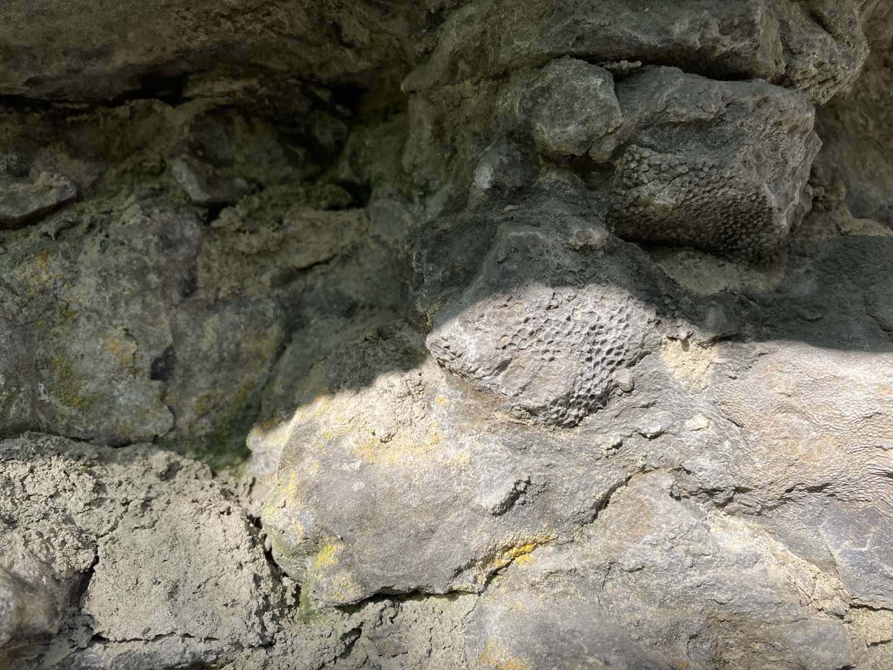
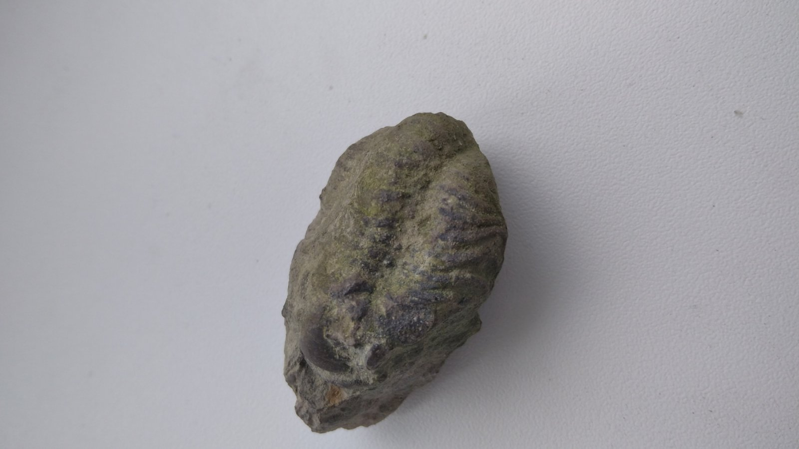

## Силур
- Тривав 24 млн років (443 - 419 млн р. тому)
- Живі істоти тільки почали виходити на суходіл
- У морях панували величезні головоногі та ракоскорпіони
- У каньйоні ріки Смотрич (м.Кам'янець-Подільський) можна знайти немало скам'янілостей цього періоду
- Нижче приведені знахідки з каньйону:
#### Різноманітні корали

#### Трилобіт

